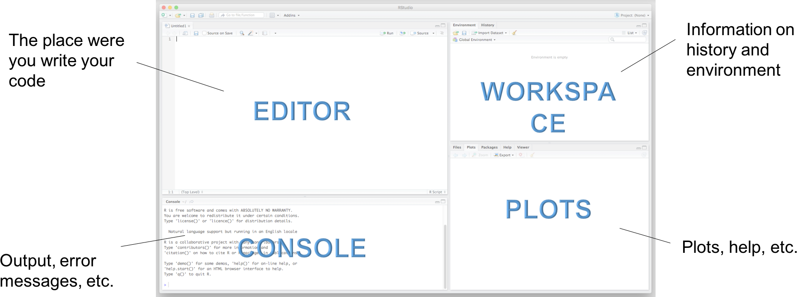

class: inverse,  center, middle

   <!--ratio: '16:9'-->


.left-column50[

# What is R?

# A First Example

# The R Ecosystem

# Data Manipulation

# Data Visualization

]
.right-column50[

.center[]

]

---
## What is R?

> R is a programming language and software  environment for statistical computing, data  analysis and graphics

* Provides  wide variety of statistical and  graphical techniques, including linear and  nonlinear modeling, classical statistical tests,  timeseries analysis, classification, clustering

* Allows for reproducible research & automation

<br>
<br>


---
## How to get started?

1. Install R from http://r-project.org

2. Install an editor like [RStudio](https://www.rstudio.com/products/rstudio/)

R Studio is an excellent FREE development environment for writing your own R code. It allows the user to run R in a more user-friendly environment.

.center[]


---
background-image: url(assets/snowflake.jpg)
background-position: top
background-size: 110%
class: center, middle, inverse

# My assay is a special fragile snowflake.


--
# Possible, but unlikely!

<br>
<br>
<br>
<br>

---
## Packages

* R *just* ships with a small set of functions.

* R can be extened with _packages_, which are collections of user written R functions, data, and compiled code in a well-defined format.

.center[]

---
background-image: url(assets/bioconductor.png)
background-position: top
background-size: 105%


---
# Example: Basic Data Flow in R

.center[]

---
exclude: true

# How to install and use a new package?


###  Install it once

```{r, eval=FALSE}
install.packages("ggplot2")
```

### Load it before you use it

```{r, eval=FALSE}
library(ggplot2)
```

---
## Example: Analysis of Mammalian Sleep Patterns


```{r setup, echo=F, warning=F, message=F}
library(readr)
library(dplyr)
library(ggplot2)

## adjust print rendering
options(
  width = 90,
  dplyr.width = 70,
  dplyr.print_max = 20
)
```

```r
# Load the libaries which we will need for the analysis
library(readr)
library(dplyr)
library(ggplot2)


## Read data from tsv and assign it to a variable
msleep = read_tsv("data/msleep.tsv")

## Explore the data
head(msleep)
glimpse(msleep)

## Create a new column
msleep = mutate(msleep, rem_proportion = sleep_rem / sleep_total)

## Analyze correlation 
ggplot(msleep, 
    aes(sleep_total, rem_proportion, color=vore, size=brainwt)
) + geom_point(alpha=0.7)
```

---
## Read Data from File and Assign it to Variable

```{r, warning=F}
msleep = read_tsv("data/msleep.tsv")
```

---
## Explore the Data


```{r, warning=F}
head(msleep)
```

---
## Explore the data (cont.)


```{r, warning=F}
glimpse(msleep)
```

---
## Create a New Column


```{r, warning=F}
msleep = mutate(msleep, rem_proportion = sleep_rem / sleep_total)

glimpse(msleep)
```

---
## Analyze Correlation

```{r, warning=F,  fig.height=6}
ggplot(msleep, 
    aes(sleep_total, rem_proportion, color=vore, size=brainwt)
) + geom_point(alpha=0.7)
```

---
## Recap: Analysis of Mammalian Sleep Patterns

```r
# Load the libaries which we will need for the analysis
library(readr)
library(dplyr)
library(ggplot2)


## Read data from tsv and assign it to a variable
msleep = read_tsv("data/msleep.tsv")

## Explore the data
head(msleep)
glimpse(msleep)

## Create a new column
msleep = mutate(msleep, rem_proportion = sleep_rem / sleep_total)

## Analyze correlation 
ggplot(msleep, 
    aes(sleep_total, rem_proportion, color=vore, size=brainwt)
) + geom_point(alpha=0.7)
```

---
## Data Manipulation with `dlyr`

> `dplyr` takes tables as input and creates new tables

It implements the following verbs useful for data manipulation:

* `select()` retains/removes a subset of variables
* `filter()` retains/removes a subset of rows
* `mutate()` derives new columns
* `arrange()` re-orders the rows in a table
* `summarise()` reduces data to a smaller number of summary statistics
* `group_by()` takes a table and converts it into a _grouped table_ where operations are performed by group

Fast, battle tested, very consistent (that is easy to learn and to recall).


```r
msleep %>% 
    filter(order=="Primates") %>%
    mutate(rem_proportion = sleep_rem / sleep_total) %>%
    select(name, rem_proportion) %>%
    filter(rem_proportion>0.3)
```


---
exclude: true

## Grammar of Graphics

<!-- https://css-tricks.com/all-about-floats/ -->
<div style="float:right; margin-left:50px; width:200px">


</div>

Decompose plots, into building blocks to create solid, creative, meaningful visualizations

* Leland Wilkinson, Grammar of Graphics, 1999
* 2 principles
  1. Graphics are composed of distinct layers of grammatical elements
  2. Data attributes mapped to aesthetics

* Formal description
```
plot ::= coord scale+ facet? layer+
layer ::= data mapping stat geom position?
```

---
## Build beautiful visualizations with `ggplot2`

1. one or more layers,
2. scales to map variables from data space to visual space (like colors)
3. a coordinate system
4. Statistical transformations
5. (optional) facetting to divide a plot into multiple panels

```{r fig.height=3}
ggplot(mtcars, aes(x=as.factor(cyl), y=mpg)) +
    geom_boxplot() +
    geom_point(position="jitter") +
    ggtitle("Relation of cylinders and fuel consumption") +
    xlab("# cylinders") + ylab("miles per gallon")
```

---

background-image: url(assets/ggplot_examples2.png)
background-position: center
background-size: 120%


---
## R is Good Scientific Practice

Excel is not. :-(

R has a learning curve but not as steep as python


???
hard at the beginning, but increasingly **fun** later

*Image Sources: [Reproducibility;](http://www.drugdesigntech.com/how-maximize-the-reproducibility-of-your-research/) [Automation](https://www.globalscape.com/managed-file-transfer/automation)*


---
class: inverse, middle, center

# Build Reports with RMarkdown

---


## Literate programming: Tell your story with data

Enable result consistency and streamline communication by building reports from R scripts intervened with a lab book.

<br>
<br>
<br>

.left-column40[

### Mix  data analysis and visualzation with text

### Build  pdfs, html or word reports with just a click
]

.right-column60[


]

---
# Example: Source Document


---
exclude: true

background-image: url(assets/spin_workflow.jpg)
background-position: bottom
background-size: 95%


---
# Exampe: Generated Report

.image-50[]

???

Pros
1. Interact with R in a **single, seamless stream**

2. **Iterate quickly** on code and output; see code and output together.

3. Leave a **clean, reproducible record** of your analysis in a simple text file.

4. Document your analysis with **rich, literate prose**

5. **Share the analysis** easily.

6. **One-click export** to HTML, PDF and Word


---
class: inverse, center, middle

# Let data tell its story

---
## Interactive Visualization with Shiny

> Shiny is an R package that makes it easy to build interactive web apps straight from R.

#### Publish complex data sets not just as dumb table, but as interactive webapp

.center[.image-50[]]

Example http://shiny.rstudio.com/gallery/movie-explorer.html

???

Extensions

- `ggvis`: Interactive, web based graphics built with the grammar of graphics (ggplot2).

- `DT`: provides an R interface to the JavaScript library DataTables.

- `htmlwidgets`: A fast way to build interactive (javascript based) visualizations with R.

---
exclude: true
background-image: url(assets/movie_explorer.png)
background-position: bottom


[open live versino](http://shiny.rstudio.com/gallery/movie-explorer.html)

---
exclude: true

# Example: interactive histogram

https://shiny.rstudio.com/gallery/single-file-shiny-app.html

```{r eval=FALSE}
# Global variables can go here
n <- 200


# Define the UI
ui <- bootstrapPage(
  numericInput('n', 'Number of obs', n),
  plotOutput('plot')
)


# Define the server code
server <- function(input, output) {
  output$plot <- renderPlot({
    hist(runif(input$n))
  })
}

# Return a Shiny app object
shinyApp(ui = ui, server = server)
```

---
exclude: true

# Resulting Website


---
# How to get started?

- Do one of the interactive Coures at [DataCamp](https://www.datacamp.com/courses/free-introduction-to-r)

- Read [R for Data Science](http://r4ds.had.co.nz/) by Grolemund & Wickham

- Print and use the [Cheatsheets](https://www.rstudio.com/resources/cheatsheets/) by RSstudio


<br>


???

Get involved

- Follow the community on  [R-Bloggers](https://www.r-bloggers.com)

- Ask questions at [BioStars](https://www.biostars.org/)

**presenter's choice**


---
class: inverse

.left-column50[


## Summary


## Learn `R` by using it!

## There's a package also for your special snowflake

## Feel welcome if you need help :-)

https://github.com/holgerbrandl/r_in_ten_minutes

]

--
.right-column50[

<br>
<br>
<br>
<br>

 ]


